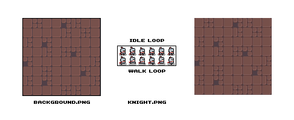

# Minimalist Game Framework #

This is a minimalist game framework in the style of the "game engine" we use at [Zachtronics](http://www.zachtronics.com). It is a thin layer over [SDL2](http://wiki.libsdl.org/FrontPage) that encourages you to modify and extend the framework to suit your needs and preferences.

# Getting Started #

1. Clone the repo.
2. Add your assets (images, fonts, sounds, and music) to the Assets folder. These files will be automatically synchronized to your build directory by a post-build step in Visual Studio.
3. Start writing your game in the `Game` class.

All functions and properties listed below are members of the static `Engine` class. For example, if you wanted to draw a line, you could call `Engine.DrawLine()` from anywhere in your code. Documentation for function arguments and enum values can be found in the code itself.

# Example #



```C#
class Game
{
    public static readonly string Title = "Minimalist Game Framework";
    public static readonly Vector2 Resolution = new Vector2(128, 128);

    // Define some constants controlling animation speed:
    static readonly float Framerate = 10;
    static readonly float WalkSpeed = 50;

    // Load some textures when the game starts:
    Texture texKnight = Engine.LoadTexture("knight.png");
    Texture texBackground = Engine.LoadTexture("background.png");

    // Keep track of the knight's state:
    Vector2 knightPosition = Resolution / 2;
    bool knightFaceLeft = false;
    float knightFrameIndex = 0;

    public Game()
    {
    }

    public void Update()
    {
        // Draw the background:
        Engine.DrawTexture(texBackground, Vector2.Zero);
        
        // Use the gamepad to control the knight, with a small "deadzone" applied to the analog stick:
        Vector2 leftStick = Engine.GetGamepadAxis(0, GamepadAxis.LeftStick);
        bool knightIdle = leftStick.Length() < 0.3f;
        if (!knightIdle)
        {
            knightPosition += leftStick * Engine.TimeDelta * WalkSpeed;
            knightFaceLeft = leftStick.X < 0;
        }

        // Advance through the knight's 6-frame animation and select the current frame:
        knightFrameIndex = (knightFrameIndex + Engine.TimeDelta * Framerate) % 6.0f;
        Bounds2 knightFrameBounds = new Bounds2(((int)knightFrameIndex) * 16, knightIdle ? 0 : 16, 16, 16);

        // Draw the knight:
        Vector2 knightDrawPos = knightPosition + new Vector2(-8, -8);
        TextureMirror knightMirror = knightFaceLeft ? TextureMirror.Horizontal : TextureMirror.None;
        Engine.DrawTexture(texKnight, knightDrawPos, source: knightFrameBounds, mirror: knightMirror);
    }
}
```

Art Source: _[https://o-lobster.itch.io/simple-dungeon-crawler-16x16-pixel-pack](https://o-lobster.itch.io/simple-dungeon-crawler-16x16-pixel-pack)_

# Core #

float **`TimeDelta`**

* The amount of time (in seconds) since the last frame.

# Content #

Texture **`LoadTexture`**(string path)

* Loads a texture from the Assets directory. 
* Supports the following formats: BMP, GIF, JPEG, PNG, SVG, TGA, TIFF, WEBP.

ResizableTexture **`LoadResizableTexture`**(string path, int leftOffset, int rightOffset, int topOffset, int bottomOffset)

* Loads a resizable texture from the Assets directory. 
* Supports the following formats: BMP, GIF, JPEG, PNG, SVG, TGA, TIFF, WEBP.
* See below for an explanation of how resizable textures work.

Font **`LoadFont`**(string path, int pointSize)

* Loads a font from the Assets directory for a single text size.
* Supports the following formats: TTF, FON.

Sound **`LoadSound`**(string path)

* Loads a sound file from the Assets directory. 
* Supports the following formats: WAV, OGG.

Music **`LoadMusic`**(string path)

* Loads a music file from the Assets directory. 
* Supports the following formats: WAV, OGG, MP3, FLAC.

# Graphics #

void **`DrawLine`**(Vector2 start, Vector2 end, Color color)

* Draws a line.

void **`DrawRectEmpty`**(Bounds2 bounds, Color color)

* Draws an empty rectangle.

void **`DrawRectSolid`**(Bounds2 bounds, Color color)

* Draws a solid rectangle.

void **`DrawTexture`**(Texture texture, Vector2 position, Color? color, Vector2? size, float rotation, Vector2? pivot, TextureMirror mirror, Bounds2? source, TextureBlendMode blendMode, TextureScaleMode scaleMode)

* Draws a texture.
* Look at the code for more information about the function arguments. Most of them are optional.

void **`DrawResizableTexture`**(ResizableTexture texture, Bounds2 bounds, Color? color, TextureBlendMode blendMode, TextureScaleMode scaleMode)

* Draws a resizable texture.
* See below for an explanation of how resizable textures work.

Bounds2 **`DrawString`**(string text, Vector2 position, Color color, Font font, TextAlignment alignment, bool measureOnly)

* Draws a text string. 
* Returns the bounds of the drawn text.

# Keyboard Input #

bool **`GetKeyDown`**(Key key, bool allowAutorepeat)

* Returns true if a key was pressed down this frame.

bool **`GetKeyHeld`**(Key key)

* Returns true if a key was held during this frame.

bool **`GetKeyUp`**(Key key)

* Returns true if a key was released this frame.

string **`TypedText`**

* The textual representation of the keys that were pressed this frame.

# Mouse Input #

Vector2 **`MousePosition`**

* The current position of the mouse cursor (in pixels).

Vector2 **`MouseMotion`**

* The change in position of the mouse cursor this frame (in pixels).

float **`MouseScroll`**

* The amount the mouse wheel has been scrolled this frame (in scroll units).

bool **`GetMouseButtonDown`**(MouseButton button)

* Returns true if a mouse button was pressed down this frame.

bool **`GetMouseButtonHeld`**(MouseButton button)

* Returns true if a mouse button was held during this frame.

bool **`GetMouseButtonUp`**(MouseButton button)

* Returns true if a mouse button was released this frame.

void **`SetMouseMode`**(MouseMode mode)

* Sets the mouse mode, which controls the visibility and lock state of the cursor.

# Gamepad Input #

bool **`GetGamepadConnected`**(int player)

* Returns true if a player's gamepad is connected.

Vector2 **`GetGamepadAxis`**(int player, GamepadAxis axis)

* Reads the analog values of the specified axis on a player's gamepad.

bool **`GetGamepadButtonDown`**(int player, GamepadButton button)

* Returns true if a gamepad button was pressed down this frame.

bool **`GetGamepadButtonHeld`**(int player, GamepadButton button)

* Returns true if a gamepad button was held during this frame.

bool **`GetGamepadButtonUp`**(int player, GamepadButton button)

* Returns true if a gamepad button was released this frame.

# Audio #

SoundInstance **`PlaySound`**(Sound sound, bool repeat, float fadeTime)

* Plays a sound.
* Returns an instance handle that can be passed to StopSound() to stop playback of the sound.

void **`StopSound`**(SoundInstance instance, float fadeTime)

* Stops a playing sound.

void **`PlayMusic`**(Music music, bool looping, float fadeTime)

* Plays music, stopping any currently playing music first.

void **`StopMusic`**(float fadeTime)

* Stops the current music.

# Utility Classes #

class **`Vector2`**

* A simple 2D vector class that supports basic vector math operations that is used in many API functions.

class **`Bounds2`**

* A simple axis-aligned 2D bounding rectangle that is used in a few API functions.

class **`Color`**

* A data structure representing a 32-bit RGBA color that is used in many API functions. 
* The class also contains static members for all of the built-in .NET colors, e.g. `Color.CornflowerBlue` and others.

# Appendix 1: Screen Resolution #

To keep things simple, the resolution of the game is fixed and specified at the top of the `Game` class. 

If you hit Alt+Enter while the game is running it will toggle between windowed and fullscreen.
* When running windowed the window will be the same size as the specified resolution. 
* When running fullscreen the game will scale up to fit your screen and automatically letterbox if the aspect ratios do not match (so that the contents are not distorted).

# Appendix 2: Resizable Textures #

Most of the asset types supported should be fairly obvious, but the framework also supports something ambiguously called a "resizable texture". Sometimes also called "nine-patches" or "border textures", these are textures that are divided into nine areas (specified at load time as numerical offsets from the edges) so that they can be drawn at different sizes without distorting the edges. The following example creates a resizable texture of a button and then draws it four times with different sizes:

```C#
ResizableTexture button = Engine.LoadResizableTexture("button.png", 20, 20, 20, 40);
Engine.DrawResizableTexture(button, new Bounds2(10, 40, 50, 80));
Engine.DrawResizableTexture(button, new Bounds2(70, 20, 100, 60));
Engine.DrawResizableTexture(button, new Bounds2(180, 10, 70, 100));
Engine.DrawResizableTexture(button, new Bounds2(260, 30, 120, 90));
```


